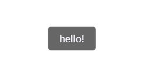

This document is machine translated and may not be accurate in some places.

# WebSimpleToast

WebSimpleToast is a lightweight toast frame library used in the web.\
Easy to use, expandable style.
> *Deployment can be completed in just **5 minutes***



## Introduce

The following methods can be used to introduce this library:

- Introducing from jsDelivr

  ``` html
  <link rel="stylesheet" href="https://cdn.jsdelivr.net/gh/hgnim/WebSimpleToast@1.0.0/dist/css/toast.min.css" type="text/css">
  <script src="https://cdn.jsdelivr.net/gh/hgnim/WebSimpleToast@1.0.0/dist/js/toast.min.js" type="text/javascript"></script>
  ```

- Install from GitHub using npm

  ```sh
  npm install hgnim/WebSimpleToast
  ```

  or

  ```sh
  npm install hgnim/WebSimpleToast#1.1.1
  ```

- Clone this repository

## Use

### Function definition

``` javascript
async function showToast(message,duration = 3000,toast_class = "",toastContent_class = "",parentId = null,finish=()=>{})
```

- `message`: The text content to be displayed within the toast box
- `duration`: The duration of continuous display of the toast box
- `toast_class`: Toast box requires additional CSS classes to be added
- `toastContent_class`: Toast box content requires additional CSS classes to be added
- `parentId`: The parent container ID to which the toast box needs to be added
  - If the value is `null` (default), add to `<body>`
- `finish`: This callback function will be called after the toastbox disappears.

### Example

``` javascript
//Pop up a toast box with the content "hello", duration of 5 seconds, class containing "test_style test2_style", and parent container "test_div".
showToast("hello", 5000, "test_style test2_style", undefined, "test_div");
```

## Demo

[Demo files](https://github.com/Hgnim/WebSimpleToast/tree/gh-pages/demo)\
[Demo page](https://hgnim.github.io/WebSimpleToast/demo/)
